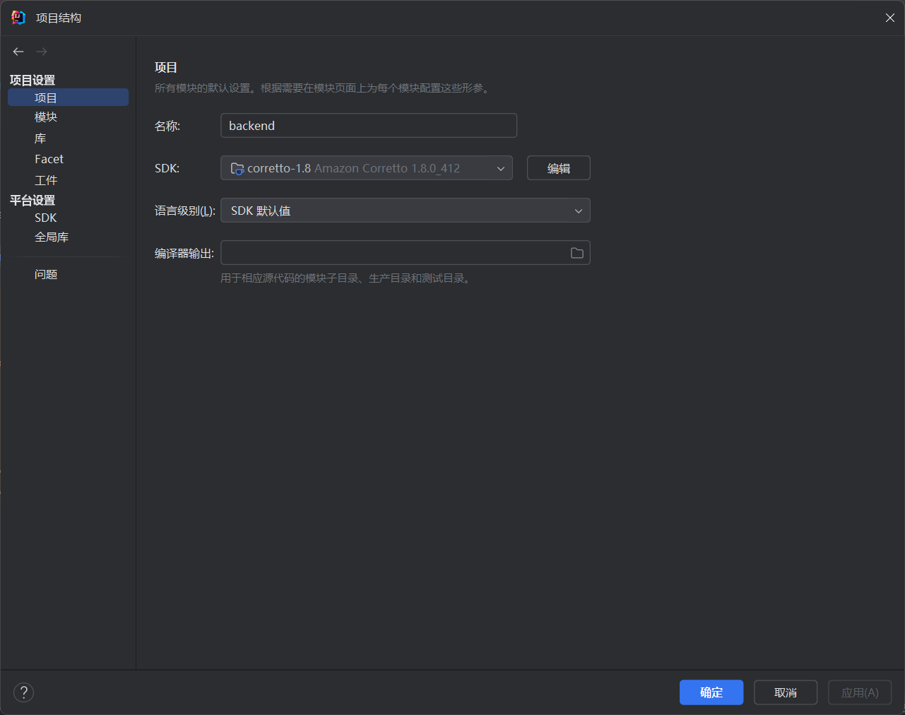
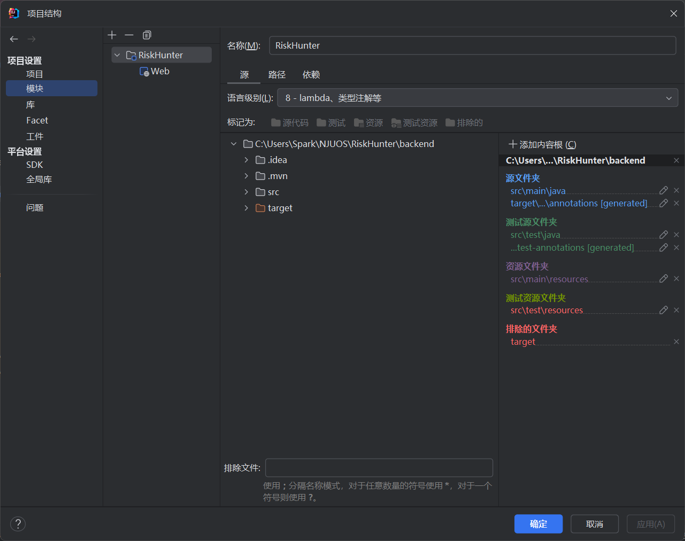
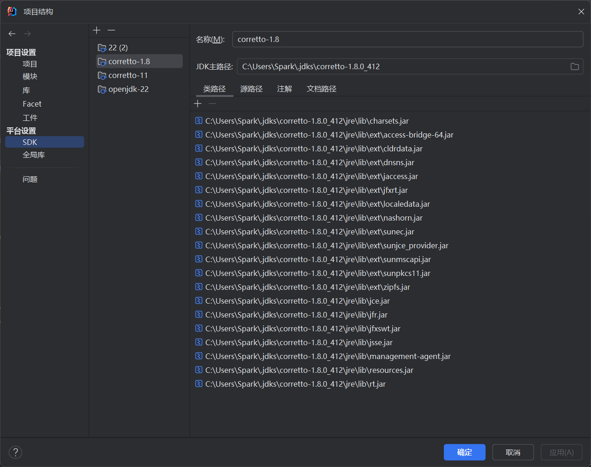

# RiskHunter
[TOC]

## 项目概述
RiskHunter 是一个前后端分离的项目，前端基于 Vite + Vue3 框架搭建，后端采用 Spring Boot 构建。该项目整合了先进的统计与 AI 技术，能够对过往趋势进行整合分析，通过多维度的数据模型精准捕捉汇率风险信号，为企业提供更具前瞻性、科学性的风险管理支持。

## 本地部署指南

### 环境准备

#### 前端环境
- **Node.js**：建议使用 v16 及以上版本。可从 [Node.js 官网](https://nodejs.org/) 下载并完成安装。
- **npm**：Node.js 自带 npm 包管理器，安装 Node.js 后即可使用。

#### 后端环境
- **Java**：建议使用 **Java 8**版本。可从 [Oracle 官网](https://www.oracle.com/java/technologies/javase-downloads.html) 或 [OpenJDK 官网](https://openjdk.java.net/) 下载并安装。
- **Maven**：用于项目的依赖管理和构建。可从 [Maven 官网](https://maven.apache.org/download.cgi) 下载并配置环境变量。
- **MySQL**：用于存储项目数据。可从 [MySQL 官网](https://dev.mysql.com/downloads/installer/) 下载并安装。

### 前端部署步骤

#### 1. 克隆项目代码
```bash
git clone https://github.com/SparkNJU/RiskHunter.git
cd RiskHunter/frontend
```

#### 2. 前端安装依赖
```bash
cd RiskHunter/frontend
npm install
```
该过程可能需要等待一段时间

#### 3. 前端启动
```bash
npm run dev
```
你可以自行在vite.config.ts里选择合适的启动端口

### 后端部署步骤

#### 1. 克隆项目代码
```bash
git clone https://github.com/SparkNJU/RiskHunter.git
cd RiskHunter/backend
```
#### 2. 后端依赖安装
后端项目使用 Maven 进行依赖管理，在 backend 目录下，执行以下命令安装依赖：

```bash
cd RiskHunter/backend
mvn clean install
```
该过程可能需要等待一段时间

#### 3. 数据库配置(首次需要)
请您预先安装好MySQL，建议客户端版本在9.0以上
打开 MySQL 客户端，创建一个名为 riskhunter 的数据库：
```SQL
CREATE DATABASE IF NOT EXISTS riskhunter;
USE riskhunter;
```
随后执行我们的建表文件establishTable.sql：
```SQL
SOURCE backend/establishTable.sql;
```
请您记得替换成实际的路径，或者在IDE中直接执行establishTable.sql，当命令行提示没有报错，即为成功配置数据库。

MySQL配置好后，您需要在backend/src/main/resources/application.yml文件中将配置修改为您实际的本地数据库信息：
``` yml
    url: jdbc:mysql://localhost:3306/riskhunter?useSSL=false&serverTimezone=Asia/Shanghai&allowPublicKeyRetrieval=true&useSSL=false
    username: root
    password: 123456
```
#### 4. 后端启动
请注意，为了避免版本更新带来的不稳定因素，我们**强烈建议**您使用**JDK 8**来启动后端项目，请检查您的IDE的项目设置部分。我们推荐使用Intellij IDEA来启动我们的项目，如果遇到版本相关问题，下面是您可能需要修改的地方。



当您修改完之后，请您**应用**修改完的配置
随后您可以在backend/src/main/java/com/RiskHunter/RiskHunterApplication.java文件中点击运行，项目启动。

我们同样建议您使用我们为您准备好的Jar包
``` bash
java -jar target/RiskHunter-0.0.1-SNAPSHOT.jar
```

如果出现MySQL的链接问题，尝试用密码参数覆盖
``` bash
java -jar target/RiskHunter-0.0.1-SNAPSHOT.jar --spring.datasource.password=本地实际密码
```
经过以上操作，您应该可以正常运行RiskHunter项目。