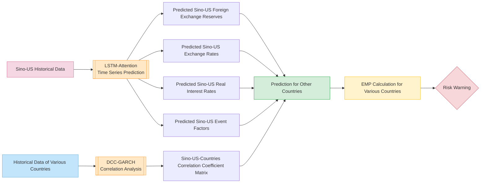

# RiskHunter Foreign Exchange Risk Prediction Model Design Document
**Version**: v1.0.6
**Author**: NJU-SagaCiti
**Last Updated**: 2025.3.21

[TOC]

## Software Design Framework  
---

## Risk Capture Model  

### Risk Signal Indicator Design  
Financial risks are closely related to foreign exchange reserves, real interest rates, currency exchange rates, and emergency event impact factors. A linear model is used to consider this relationship, defining the risk signal indicator as the absolute value of their linear combination:  
$$
\text{EMP} = \left|w^T y\right|
$$  
Where:  
- $y = [y_1, y_2, y_3, y_4]$ represents foreign exchange reserves, real interest rates, currency exchange rates, and event impact factors, respectively.  
- $w = [w_1, w_2, w_3, w_4]$ are the weights.  
- A larger EMP indicates greater risk. When $EMP \geq 0.10$, a financial risk is considered present.  

---

### Overall Architecture  

#### Historical Data Required for Prediction  
FDI, M2, M2 multiplier, fiscal deficit, export growth rate, loan-to-deposit ratio, short-term foreign debt, claims on the private sector, housing price growth rate, industrial added value, domestic and foreign real deposit interest rate differential, domestic credit, net foreign assets, exchange rate expectations, foreign debt of financial institutions, securities and investments of financial institutions, real exchange rate overvaluation, real interest rate, inflation rate, foreign exchange reserves, crude oil price growth rate, TED spread, US dollar index, and emergency event indicators for various countries.  

#### Model Calculation Process  
1. Input Sino-US historical data into the LSTM-Attention model for time series prediction to obtain future Sino-US foreign exchange reserves, exchange rates, real interest rates, and emergency event impact factors.  
2. To enhance the model's universality, use the DCC-GARCH model to analyze the correlation between Sino-US and other countries' data, enabling prediction of foreign exchange reserves, exchange rates, real interest rates, and emergency event impact factors for other countries based on predicted Sino-US data.  
3. Calculate EMP according to its definition to analyze the magnitude of financial risks in various countries.  



---

### LSTM-Attention Time Series Forecasting Model  

#### Model Input  
A multivariate feature sequence with a time window length of $T$:  
$$
\mathbf{X}_t = [x_t^{(1)}, x_t^{(2)}, ..., x_t^{(d_n)}] \in \mathbb{R}^{T \times d_n}
$$  
- $x^{(k)}_t$: The $k$-th dimensional input feature at time node $t$ (e.g., foreign exchange reserves, etc.).  

#### Model Structure  
$$
\text{Input} \xrightarrow[\text{LSTM Layer}]{} H \xrightarrow[\text{Self-Attention}]{} C \xrightarrow[\text{Feed Forward}]{} \hat{Y}
$$  

##### LSTM Encoding Layer  
$$
H = \text{LSTM}(X)
$$  
- $H$ is the hidden layer state of all time steps output by LSTM, $H \in \mathbb{R}^{T \times d_h}$.  
- $d_h$ is the hidden layer size, set to 128.  

##### Self-Attention Mechanism  

###### 3.1 Attention Weight Calculation  
$$
A = \text{softmax}(\tanh(HW_1 + B)W_2 + b)
$$  
- $W_1 \in \mathbb{R}^{d_h \times 32}$, $W_2 \in \mathbb{R}^{T \times 1}$, $b \in \mathbb{R}^{T \times 1}$, $B \in \mathbb{R}^{T \times 32}$ are learnable parameters in the linear layers.  
- $A \in \mathbb{R}^{T \times 1}$.  
- $\text{softmax}(z_i) = \frac{e^{z_i}}{\sum_{j=1}^n e^{z_j}}$.  
- $\tanh(x) = \frac{e^x - e^{-x}}{e^x + e^{-x}}$.  

###### 3.2 Context Vector Generation  
$$
C = \sum_{t=1}^T A^{(t)} \odot H^{(t)} \quad \in \mathbb{R}^{d_h}
$$  
- $\odot$ denotes element-wise multiplication after broadcasting $A$ to the same dimension as $H$.  

###### 3.3 Feed-Forward Output Layer  
$$
\hat{Y} = \text{ReLU}(CW_3 + b_3)W_4 + b_4
$$  
- $W_3 \in \mathbb{R}^{d_h \times 128}$, $W_4 \in \mathbb{R}^{128 \times d_{\text{out}}}$, $b_3 \in \mathbb{R}^{128}$, $b_4 \in \mathbb{R}^{d_{\text{out}}}$ are learnable parameters in the linear layers.  
- $\hat{Y} \in \mathbb{R}^{d_{\text{out}}}$ is the feature output of the model.  

#### Dimension Transformation Table  
| Stage              | Tensor Shape       | Description               |
|--------------------|--------------------|---------------------------|
| Raw Input          | $T \times d_{\text{in}}$ | Batch input sequence      |
| LSTM Output        | $T \times d_h$     | Time-step hidden states   |
| Attention Weights  | $T \times 1$       | Sequence importance distribution |
| Context Vector     | $d_h$              | Weighted aggregated representation |
| Final Output       | $d_{\text{out}}$   | Prediction results        |

#### Hyperparameter Description  
- **LSTM Parameters**:  
  `hidden_size` ($d_h$): Hidden layer dimension: 128  
  `num_layers`: Number of stacked LSTM layers: 1  

- **Attention Parameters**:  
  Intermediate dimension compressed to 32.  

- **Output Layer Parameters**:  
  Intermediate layer dimension expanded to 128.  

---

### DCC-GARCH Correlation Coefficient Analysis  

#### Model Definition  
Modeling the residuals $\boldsymbol{\epsilon}_t$ of economic indicators for $n$ regions:  
$$
\boldsymbol{\epsilon}_t = \mathbf{H}_t^{1/2} \mathbf{z}_t, \quad \mathbf{z}_t \sim N(0, \mathbf{I})
$$  
Dynamic conditional correlation coefficient matrix:  
$$
\mathbf{Q}_t = (1 - \theta_1 - \theta_2) \bar{\mathbf{Q}} + \theta_1 \boldsymbol{\epsilon}_{t-1} \boldsymbol{\epsilon}_{t-1}^\top + \theta_2 \mathbf{Q}_{t-1}
$$  
Standardized correlation coefficient matrix:  
$$
\mathbf{R}_t = \text{diag}(\mathbf{Q}_t)^{-1/2} \mathbf{Q}_t \text{diag}(\mathbf{Q}_t)^{-1/2}
$$  

#### Cross-Regional Prediction  
Prediction of the $i$-th country's indicator:  
$$
\hat{y}_i^{(t+1)} = \rho_{i,\text{US}}^{(t)} \hat{y}_{\text{US}}^{(t+1)} + \rho_{i,\text{CN}}^{(t)} \hat{y}_{\text{CN}}^{(t+1)} + \epsilon_i
$$  
Where $\rho$ is derived from the real-time correlation coefficients in the $\mathbf{R}_t$ matrix.  

---

### Data Processing Instructions  

#### News Indicator Quantification Based on DeepSeek API  
1. **Text Preprocessing**: Crawl news from various countries at each time point and organize it by date.  
2. **News Impact Quantification**:  
   Access the DeepSeek API to quantify the impact of input news on each country, obtaining emergency event impact factors as part of the LSTM input:  
#### Processing of LSTM-Attention Input Data  
Split a complete historical time series into multiple time series for model training, allowing overlap between sequences to enhance data utilization.  

---

### Model Training and Optimization  

#### Optimizer  
Adam optimizer.  

#### Loss Function  
MSE (Mean Squared Error) loss function:  
\[
\text{MSE} = \frac{1}{N} \| \mathbf{y} - \hat{\mathbf{y}} \|_2^2
\]  
**Explanation**:  
- \( N \): Number of samples.  
- \( \mathbf{y} \): True value vector containing all samples' true values.  
- \( \hat{\mathbf{y}} \): Predicted value vector containing all samples' predictions.  
- \( \| \cdot \|_2 \): Represents the \( L_2 \) norm (Euclidean norm).  
```