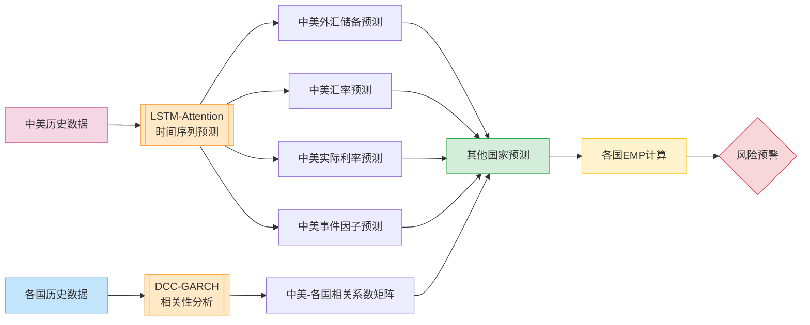

# RiskHunter 外汇风险预测模型设计文档
**版本号**：v1.0.6
**作者**：NJU-SagaCiti团队
**最后更新**：2025.3.21

[TOC]

## 软件设计框架
---

## 风险捕捉模型

### 风险信号指标设计
金融风险与外汇储备、实际利率、货币汇率以及突发事件影响因子密切相关，使用线性模型来考虑这种关系,定义风险信号指标为他们的线性组合的绝对值：
$$
\text{EMP} = \left|w^T y\right|
$$
其中：
- $y = [y_1, y_2, y_3,y_4]$ 分别表示外汇储备、实际利率、货币汇率,事件影响因子
- $w = [w_1, w_2, w_3,w_4]$ 为权重
- EMP越大说明风险越大,当$EMP\geq 0.10$时认为存在金融风险
---

### 整体架构
#### 预测所需历史数据
FDI、M2、M2乘数、财政赤字、出口增长率、贷款比存款、短期外债、对私人部门债权、房价增长率、工业增加值、国内外实际存款利率差、国内信贷、国外净资产、汇率预期、金融机构外债、金融机构有价证券及投资、实际汇率高估、实际利率、通货膨胀率、外汇储备、原油价格增长率、TED、美元指数,各国突发事件指标
#### 模型计算流程
先将中美历史数据输入到$lstm$结合注意力机制模型进行时间序列预测,得到未来一段时间的中美外汇储备,汇率,实际利率以及突发事件影响因子,同时为了提高模型的普适性,使用$DCC-GARCH$模型分析中美与其他国家的数据的相关性,进而可以通过预测的中美数据对其他国家的外汇储备,汇率,实际利率和突发事件影响因子进行预测,并根据EMP的定义对EMP进行计算用于分析各国金融风险大小

---

### LSTM-Attention时间序列预测模型
#### 模型输入
时间窗口长度为 $T$ 的多元特征序列：
$$
\mathbf{X}_t = [x_t^{(1)}, x_t^{(2)}, ...,x_t^{(d_n)}] \in \mathbb{R}^{T \times d_n}
$$
- $x^{(k)}_t$:第t个时间节点的第$k$维输入特征(即外汇储备等数据)
#### 模型结构
```math
\text{Input} \xrightarrow[\text{LSTM Layer}]{} H \xrightarrow[\text{Self-Attention}]{} C \xrightarrow[\text{Feed Forward}]{} \hat{Y}
```
##### LSTM编码层
$$
H = \text{LSTM}(X) $$
- $H$是$lstm$输出的所有时间步的隐藏层状态,$H \in \mathbb{R}^{T \times d_h}$ 
- $d_h$是隐藏层的大小,设置大小为128

#####  自注意力机制
###### 3.1 注意力权重计算
$A = softmax(\tanh(HW_1+ B)W_2+ b) $

- $W_1 \in \mathbb{R}^{d_h \times 32},\ W_2 \in \mathbb{R}^{T\times 1}$，$b\in\mathbb{R}^{T\times 1},B\in\mathbb{R}^{T\times 32}$,这四个变量都是线性层中的可学习参数
- $A \in\mathbb{R}^{T \times 1}$
- $b\in\mathbb{R}^{T\times 1}$
- $softmax(z_i)=\frac{e^z_i}{\sum_{j=1}^ne^z_j}$
- $Tanh(x)=\frac{e^x-e^{-x}}{e^x+e^{-x}}$

###### 3.2 上下文向量生成
```math
C = \sum_{t=1}^T A^{(t)} \odot H^{(t)} \quad \in \mathbb{R}^{d_h}
```
- $\odot$表示将$A$广播到与$H$相同维度后与H逐元素相乘

###### 3.3 前馈输出层
$\hat{Y} = \text{ReLU}(CW_3 + b_3)W_4+ b_4$
- $W_3 \in \mathbb{R}^{d_h \times 128},\ W_4 \in \mathbb{R}^{128 \times d_{out}},b_3\in\mathbb{R^{128}},b_4\in\mathbb{R^{d_out}}$,这四个都是线性层中的可学习参数
- $\hat{Y} \in \mathbb{R}^{ d_{out}}$是模型的特征输出
#### 维度变换表
| 阶段                | 张量形状                | 说明                     |
|--------------------|-----------------------|------------------------|
| 原始输入             | $T \times d_{in}$ | 批量输入序列              |
| LSTM输出            | $T \times d_h$   | 时间步隐藏状态            |
| 注意力权重           | $T \times 1$     | 序列重要性分布            |
| 上下文向量           | $d_h$            | 加权聚合表示              |
| 最终输出             | $d_{out}$        | 预测结果                 |

#### 超参数说明
- **LSTM参数**：  
  `hidden_size` ($d_h$): 隐藏层维度 :128
  `num_layer`: LSTM堆叠层数:1

- **注意力参数**：  
  中间维度压缩至32维

- **输出层参数**：  
  中间层维度扩展至128维

---
### DCC-GARCH 相关系数分析
#### 模型定义
对 $n$ 个地区的经济指标残差 $\boldsymbol{\epsilon}_t$ 建模：
$$
\boldsymbol{\epsilon}_t = \mathbf{H}_t^{1/2} \mathbf{z}_t, \quad \mathbf{z}_t \sim N(0, \mathbf{I})
$$
动态条件相关系数矩阵：
$$
\mathbf{Q}_t = (1 - \theta_1 - \theta_2) \bar{\mathbf{Q}} + \theta_1 \boldsymbol{\epsilon}_{t-1} \boldsymbol{\epsilon}_{t-1}^\top + \theta_2 \mathbf{Q}_{t-1}
$$
标准化相关系数矩阵：
$$
\mathbf{R}_t = \text{diag}(\mathbf{Q}_t)^{-1/2} \mathbf{Q}_t \text{diag}(\mathbf{Q}_t)^{-1/2}
$$

#### 跨区域预测
对第 $i$ 个国家的指标预测：
$$
\hat{y}_i^{(t+1)} = \rho_{i,US}^{(t)} \hat{y}_{US}^{(t+1)} + \rho_{i,CN}^{(t)} \hat{y}_{CN}^{(t+1)} + \epsilon_i
$$
其中 $\rho$ 来自 $\mathbf{R}_t$ 矩阵的实时相关系数。

---

### 数据的处理说明
#### 基于$deepseek\;API$的新闻指标量化
1. **文本预处理**：使用爬虫爬取各个时间点各个国家的新闻并按日期进行整理
2. **新闻影响量化**：
    接入$deepseek$接口让其对输入的新闻对隔各个国家的影响进行量化,得到突发事件影响因子作为$lstm$输入的一部分
#### $lstm-Attention$输入数据的处理
将一条完整的历史时间序列数据进行分割，得到多条时间序列数据进行模型训练,同时允许各条序列之间有重复的部分以增强数据的利用率

---

### 模型训练与优化
#### 优化器
$Adam$优化器
#### 损失函数
$MSE$均方误差损失函数
\[
\text{MSE} = \frac{1}{N} \| \mathbf{y} - \hat{\mathbf{y}} \|_2^2
\]
**说明**：
- \( N \)：样本数量。
- \( \mathbf{y} \)：真实值向量，包含所有样本的真实值。
- \( \hat{\mathbf{y}} \)：预测值向量，包含所有样本的预测值。
- \( \| \cdot \|_2 \)：表示 \( L_2 \) 范数（欧几里得范数）。