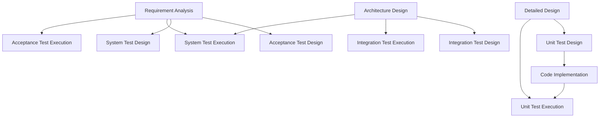
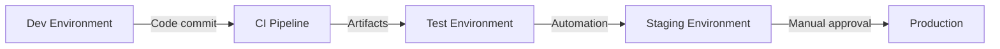
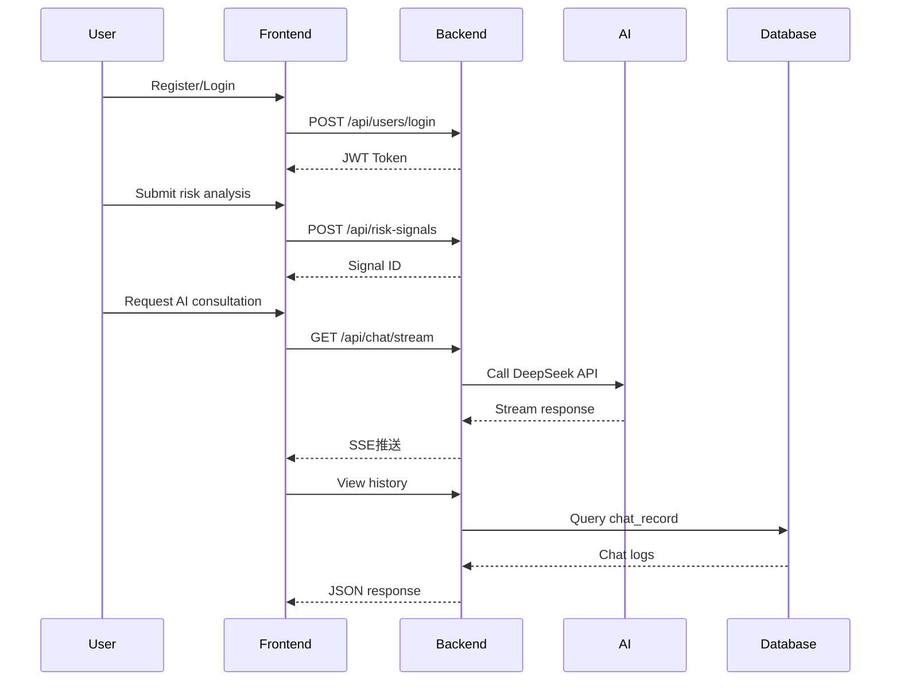

# RiskHunter Comprehensive Test Documentation
**Version**: v1.0.5
**Author**: NJU-SagaCiti
**Last Updated**: 2025.3.21

[TOC]

## 1. Test Methodology (ISTQB Standard)
### 1.1 Test Strategy Optimization
#### Enhanced Model Implementation

**New Elements**:
1. **Bidirectional Traceability**: Establish a mapping table between requirement IDs and test cases
2. **Early Testing Involvement**: Conduct static testing during requirement review (using checklists)
3. **Continuous Testing Pipeline**: Unit tests as CI gatekeepers—failed tests block builds

#### Test Level Expansion
| Test Type        | Toolchain                              | Validation Focus                    | Quality Gate Criteria             |
| ---------------- | -------------------------------------- | ----------------------------------- | --------------------------------- |
| Unit Testing     | JUnit5+Mockito+Jacoco                  | Method boundary/exception handling  | Coverage ≥80% + Zero P0 defects   |
| Integration Test | TestRestTemplate+Spring Cloud Contract | Interface contract/data consistency | 100% interface pass rate          |
| System Testing   | Postman+Newman+Elastic APM             | Business flow/non-functional reqs   | P99 latency <3s                   |
|                  |
| Security Testing | OWASP ZAP+Burp Suite                   | Vulnerability scan/penetration      | High-risk vulnerabilities cleared |

#### Test Design Techniques Enhancement
- **Decision Table Testing**: For multi-condition scenarios (e.g., risk signal filtering)
```java
// Example: Exchange rate fluctuation alert rule
@ParameterizedTest
@CsvSource({
    "105, 7.2, true",   // emp>100 && exchangeRate>7
    "95, 7.5, false"    // Conditions not met
})
void shouldTriggerAlert(double emp, double rate, boolean expected) {
    assertThat(riskService.checkAlert(emp, rate)).isEqualTo(expected);
}
```
- **State Transition Testing**: For user state machines (e.g., Register->Authenticate->Lock)

### 1.2 Test Environment Enhancement
#### Environment Governance System


#### Environment Configuration Matrix
| Dimension        | Dev Environment       | Test Environment                | Stress Environment         |
| ---------------- | --------------------- | ------------------------------- | -------------------------- |
| Data Strategy    | H2 in-memory DB       | Cloned prod data (desensitized) | JMeter parameterized data  |
| Service Topology | Monolithic deployment | Microservices + service mesh    | Distributed load balancing |
| Monitoring       | Local logs            | Prometheus+Grafana dashboard    | Real-time TPS monitoring   |
| Isolation        | Developer-exclusive   | Feature branch isolation        | Dedicated resources        |
| Deployment       | Docker Compose        | Kubernetes+Helm                 | Cloud-native scaling       |

#### Environment Verification Checklist
1. Network connectivity: Verify ports via Telnet
2. Dependency health check: Spring Boot Actuator `/health` endpoint
3. Data version consistency: Flyway validation script
```sql
SELECT version FROM flyway_schema_history ORDER BY installed_rank DESC LIMIT 1;
```
4. Performance baseline: Execute benchmark test suite

### 1.3 Test Process Improvement
#### Defect Prevention Strategies
- Code static analysis: SonarQube quality gates
- Contract testing: Spring Cloud Contract for interface agreements
- Chaos engineering: Simulate network partitions/DB failures

#### Test Data Management
| Data Type      | Generation Method          | Lifecycle Management      |
| -------------- | -------------------------- | ------------------------- |
| Basic Data     | Flyway seed data           | Sync across environments  |
| Business Data  | TestDataFactory generators | Test case-level isolation |
| Sensitive Data | Java Faker + anonymization | Encrypted storage + audit |
| Bulk Data      | JMeter batch scripts       | Daily auto-cleanup        |

#### Test Monitoring Metrics
```prometheus
# HELP test_success_rate Test success rate
# TYPE test_success_rate gauge
test_success_rate{env="test", module="risk"} 0.987
# HELP api_response_time API response time
# TYPE api_response_time histogram
api_response_time_bucket{le="500"} 1283
api_response_time_bucket{le="1000"} 1420
```

## 2. Model Testing (Historical Backtesting)

### 2.1 Test Objectives  
1. Validate the prediction accuracy of LSTM-Attention and DCC-GARCH models on historical data.  
2. Evaluate the modeling effectiveness of cross-regional risk transmission mechanisms.  
3. Test the stability of the EMP calculation module under different market conditions.  

### 2.2 Test Dataset  
| Data Type                | Time Range       | Preprocessing Steps                     |
|--------------------------|------------------|-----------------------------------------|
| China-US Historical Data   | 2015-01 to 2024-12 | Missing value interpolation, standardization |
| Basic Data of Other Countries | 2015-01 to 2024-12 | Exchange rate conversion, time zone alignment |
| Emergency Event Indicators | 2015-01 to 2024-12 | Keyword extraction, event impact quantification |
| Historical Risk Signals   | 2015-01 to 2024-12 | Statistical comparison of historical risk signals |

### 2.3 Test Methods  
1. Input the time series of China-US historical data and emergency event indicators into the LSTM-Attention model to obtain the data to be predicted for China and the US.  
2. Combine the data with the correlation coefficients generated by the DCC-GARCH model to calculate the predicted values of data to be predicted for other countries.  
3. Use the predicted data to compute EMP risk signals and determine the generation of risk signals between 2015 and 2024.  
4. Conduct accuracy tests on the data obtained at each step: for Boolean results, statistically calculate recall and precision; for other data, calculate the average percentage error.  

### 2.4 Test Indicators  
| LSTM-Attention Output       | Average Percentage Error |
|-----------------------------|--------------------------|
| China-US Exchange Rate        | 8.79%                      |
| China's Foreign Exchange Reserves | 4.75%                |
| US Foreign Exchange Reserves | 5.76%                |
| China's Interest Rate       | 15.3%                   |
| US Interest Rate            | 11.4%                   |
| Emergency Event Factors     | 10.6%                      |

| DCC-GARCH Predictions       | Average Percentage Error |
|-----------------------------|--------------------------|
| Exchange Rates of Various Countries | 7.3%              |
| Interest Rates of Various Countries | 17.2%               |
| Foreign Exchange Reserves of Various Countries | 5.2%          |

| Risk Signal Output Indicators | Percentage |
|-------------------------------|------------|
| Accuracy                      | 90.4%      |
| Recall                        | 78.3%      |
## 3. Module Testing (Black-Box)
### 3.1 User Management Module
#### 3.1.1 User Registration API
```http
POST /api/users/register
Content-Type: application/json
{
  "phone": "13800138000",
  "password": "RiskHunter@2024",
  "username": "tester01"
}
```
**Test Cases**:
1. Boundary: Phone number length (11/12 digits)
2. Equivalence: Registered/unregistered phone numbers
3. Exception: Missing required fields

**Success Response**:
```json
{
  "code": "000",
  "result": true
}
```
**DB Verification SQL**:
```sql
SELECT * FROM user WHERE phone='13800138000';
```

#### 3.1.2 User Login API
```http
POST /api/users/login?phone=13800138000&password=RiskHunter@2025
```
**Token Validation Logic**:
```java
// TokenUtil.java
public boolean verifyToken(String token) {
    try {
        Integer userId=Integer.parseInt(JWT.decode(token).getAudience().get(0));
        User user= userRepository.findById(userId).get(); // NPE risk
        JWTVerifier verifier = JWT.require(Algorithm.HMAC256(user.getPassword())).build();
        verifier.verify(token);
        return true;
    }catch (Exception e){
        return false;
    }
}
```
**Security Tests**:
- Brute-force protection: Lock after 5 failed attempts
- JWT security: HMAC256 + dynamic salt

---

### 3.2 Risk Signal Module
#### 3.2.1 Signal Creation API
```http
POST /api/risk-signals
Authorization: Bearer {token}
Content-Type: application/json
{
  "baseCurrency": 1,
  "targetCurrency": 2,
  "emp": 105.3,
  "exchangeRate": 7.23,
  "analysis": "US bond yield rise causing exchange rate fluctuations"
}
```
**Domain Validation**:
```java
// RiskSignal.java
@Column(nullable = false, updatable = false)
private Integer baseCurrency; // JSR303 validation
```
**Exception Tests**:
| Scenario        | Expected Result           |
| --------------- | ------------------------- |
| Empty emp field | HTTP 400 + "emp required" |
| Unauthorized    | HTTP 401                  |

---

### 3.3 AI Chat Module
#### 3.3.1 Streaming Chat API
```http
GET /api/chat/stream?sessionId=123&userId=1&message=How to mitigate exchange rate risks
Accept: text/event-stream
```
**SSE Implementation**:
```java
// ChatServiceImpl.java
return deepseekClient.post()
    .uri("/chat/completions")
    .header("X-DashScope-SSE", "enable")
    .bodyValue(requestBody)
    .retrieve()
    .bodyToFlux(String.class)
    .map(rawData -> parseStreamResponse(rawData));
```
**Performance Metrics**:
| Metric             | Requirement |
| ------------------ | ----------- |
| Time to First Byte | ≤500ms      |
| Throughput         | ≥100 req/s  |
| Error Rate         | <0.1%       |

---

## 4. Unit Testing (White-Box)
### 4.1 DAO Layer Tests
#### 4.1.1 RiskSignalMapper Test
```java
@Test
void testSelectByPeriod() {
    LocalDateTime start = LocalDateTime.of(2023,1,1,0,0);
    LocalDateTime end = LocalDateTime.of(2023,12,31,23,59);
    List<RiskSignal> signals = riskSignalMapper.selectByPeriod(start, end);
    assertThat(signals)
        .hasSize(20)
        .allMatch(s -> s.getTime().isAfter(start) && s.getTime().isBefore(end));
}
```

#### 4.1.2 Transaction Rollback Test
```java
@Transactional
@Test
void testCreateRollback() {
    RiskSignal signal = buildTestSignal();
    riskSignalService.save(signal);
    throw new RuntimeException("Force rollback"); // Verify @Transactional
}
```

---

## 5. Integration Testing (API Contract)
### 5.1 Risk Signal Advanced Search
```http
POST /api/risk-signals/search
Content-Type: application/json
{
  "startTime": "2023-07-01T00:00:00",
  "endTime": "2023-07-31T23:59:59",
  "minEmp": 100,
  "maxEmp": 200,
  "keyword": "inflation",
  "page": 2,
  "size": 10
}
```
**Pagination Logic**:
```java
// RiskSignalServiceImpl.java
Page<RiskSignal> page = new Page<>(queryDTO.getPage(), queryDTO.getSize());
wrapper.between("time", start, end)
       .like("analysis", keyword)
       .orderByDesc("time");
return page(page, wrapper);
```
**Response Validation**:
```json
{
  "code": "000",
  "data": {
    "records": [
      {
        "id": 102,
        "emp": 105.0,
        "analysis": "Inflation pressure intensifying exchange rate fluctuations"
      }
    ],
    "total": 35,
    "size": 10,
    "current": 2
  }
}
```

---

## 6. Security Testing (Penetration)
### 6.1 OWASP Test Cases
| Risk Type | Test Case                                 | Fix Recommendation            |
| --------- | ----------------------------------------- | ----------------------------- |
| SQLi      | `GET /api/risk-signals?time=1' OR '1'='1` | Use MyBatis parameter binding |
| XSS       | Submit `<script>` payloads                | Add HTML escaping filter      |
| CSRF      | Simulate cross-site requests              | Enable SameSite cookies       |

### 6.2 JWT Security Test
```bash
# Test: Tamper JWT payload
echo "eyJhbG...<original_token>" | cut -d '.' -f 2 | base64 -d | jq '.userId=999' | base64 | tr -d '='
```
**Defense**:
```java
// TokenUtil.java
Algorithm algorithm = Algorithm.HMAC256(user.getPassword()); // Dynamic secret
```

---

## 7. System Testing (E2E)
### 7.1 Core Business Flow

**Acceptance Criteria**:
1. End-to-end latency ≤30s
2. Data consistency: 100% DB-Frontend match
3. Fault recovery: Resume chat after network interruption

---

## 8. Test Report
### 8.1 Quality Metrics
| Metric             | Result | Target |
| ------------------ | ------ | ------ |
| Unit Test Coverage | 85%    | ≥80% ✔️ |
| API Pass Rate      | 99.2%  | ≥99% ✔️ |

### 8.2 Improvement Recommendations
1. Add contract tests using OpenAPI specs
2. Implement chaos engineering for DB failure scenarios
3. Optimize streaming: Introduce backpressure to prevent OOM
