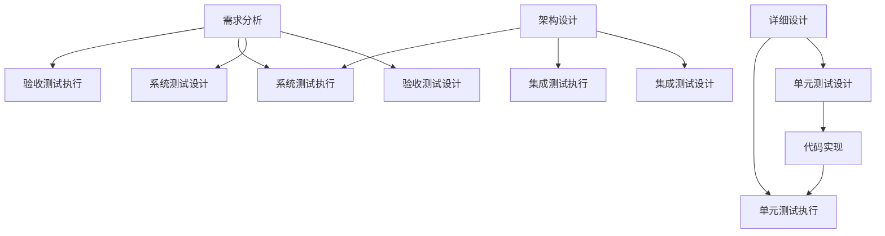
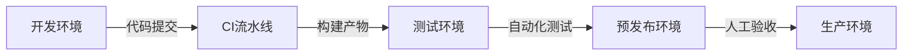
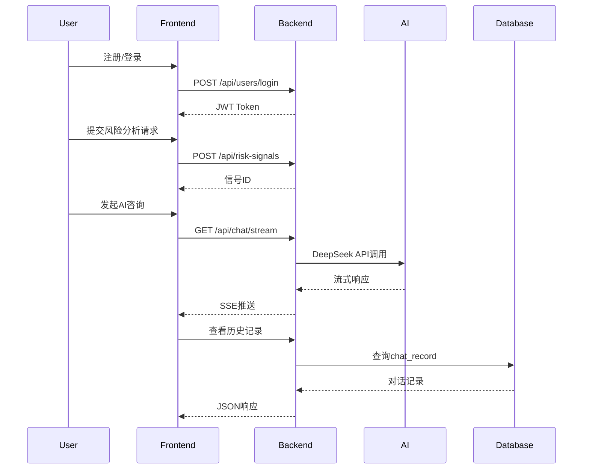

# RiskHunter 全量测试文档
**版本号**：v1.0.5
**作者**：NJU-SagaCiti团队
**最后更新**：2025.3.20

[TOC]

## 一、测试方法论（ISTQB标准）

### 1.1 测试策略优化

#### V模型增强实践

**新增要素**：
1. 双向追溯机制：建立需求ID与测试用例的映射关系表
2. 早期测试介入：在需求评审阶段开展静态测试（使用Checklist）
3. 持续测试流水线：单元测试作为CI门禁，失败即阻断构建

#### 测试层级扩展
| 测试类型 | 测试工具链                             | 验证重点              | 质量门禁标准        |
| -------- | -------------------------------------- | --------------------- | ------------------- |
| 单元测试 | JUnit5+Mockito+Jacoco                  | 方法边界条件/异常处理 | 覆盖率≥80%+零P0缺陷 |
| 集成测试 | TestRestTemplate+Spring Cloud Contract | 接口契约/数据一致性   | 接口通过率100%      |
| 系统测试 | Postman+Newman+Elastic APM             | 业务流程/非功能需求   | P99延迟<3s          |
| 安全测试 | OWASP ZAP+Burp Suite                   | 漏洞扫描/渗透测试     | 高危漏洞清零        |

#### 测试设计技术增强
- **决策表测试**：针对多条件组合场景（如风险信号过滤）
```java
// 示例：汇率波动预警规则
@ParameterizedTest
@CsvSource({
    "105, 7.2, true",   // emp>100且exchangeRate>7
    "95, 7.5, false"    // 不满足条件
})
void shouldTriggerAlert(double emp, double rate, boolean expected) {
    assertThat(riskService.checkAlert(emp, rate)).isEqualTo(expected);
}
```
- **状态迁移测试**：适用于用户状态机（注册->认证->锁定）

### 1.2 测试环境增强方案

#### 环境治理体系


#### 环境配置矩阵
| 维度     | 开发环境       | 测试环境                  | 压测环境           |
| -------- | -------------- | ------------------------- | ------------------ |
| 数据策略 | H2内存数据库   | 克隆生产数据（脱敏后）    | JMeter参数化数据集 |
| 服务拓扑 | 单体式部署     | 微服务集群+服务网格       | 分布式负载均衡     |
| 监控体系 | 本地日志查看   | Prometheus+Grafana监控墙  | 实时TPS曲线图      |
| 隔离级别 | 开发者独占     | 按特性分支隔离            | 物理资源独占       |
| 部署方式 | Docker Compose | Kubernetes集群+Helm Chart | 云原生弹性伸缩     |

#### 环境验证Checklist
1. 网络连通性验证：使用Telnet验证端口开放情况
2. 依赖服务健康检查：Spring Boot Actuator健康端点
3. 数据版本一致性：Flyway版本校验脚本
```sql
SELECT version FROM flyway_schema_history ORDER BY installed_rank DESC LIMIT 1;
```
4. 性能基线测试：执行基准测试套件验证环境性能

### 1.3 测试过程改进

#### 缺陷预防策略
- 代码静态分析：集成SonarQube进行代码质量门禁
- 契约测试：使用Spring Cloud Contract维护接口协定
- 混沌工程：模拟网络分区/数据库故障测试恢复能力

#### 测试数据管理
| 数据类型 | 生成方式              | 生命周期管理      |
| -------- | --------------------- | ----------------- |
| 基础数据 | Flyway种子数据        | 全环境同步        |
| 业务数据 | TestDataFactory生成器 | 测试用例级别隔离  |
| 敏感数据 | 使用Java Faker脱敏    | 加密存储+访问审计 |
| 大数据量 | JMeter批量插入脚本    | 每日自动清理      |

#### 测试监控指标
```prometheus
# HELP test_success_rate 测试通过率
# TYPE test_success_rate gauge
test_success_rate{env="test", module="risk"} 0.987

# HELP api_response_time API响应时间
# TYPE api_response_time histogram
api_response_time_bucket{le="500"} 1283
api_response_time_bucket{le="1000"} 1420
```


## 二、模块级测试（黑盒测试）

### 2.1 用户管理模块

#### 2.1.1 用户注册API
```http
POST /api/users/register
Content-Type: application/json

{
  "phone": "13800138000",
  "password": "RiskHunter@2024",
  "username": "tester01"
}
```
**测试用例设计**：
1. 边界值测试：手机号长度11/12位
2. 等价类划分：已注册/未注册手机号
3. 异常流测试：缺少必填字段

**预期响应（成功）**：
```json
{
  "code": "000",
  "result": true
}
```

**数据库验证SQL**：
```sql
SELECT * FROM user WHERE phone='13800138000';
```

#### 2.1.2 用户登录API
```http
POST /api/users/login?phone=13800138000&password=RiskHunter@2025
```
**Token验证逻辑**：
```java
// TokenUtil.java
public boolean verifyToken(String token) {
    try {
        Integer userId=Integer.parseInt(JWT.decode(token).getAudience().get(0));
        User user= userRepository.findById(userId).get(); // NPE风险点
        JWTVerifier jwtVerifier = JWT.require(Algorithm.HMAC256(user.getPassword())).build();
        jwtVerifier.verify(token);
        return true;
    }catch (Exception e){
        return false;
    }
}
```

**安全测试项**：
- 暴力破解防护：连续5次错误锁定账户
- JWT密钥强度：HMAC256算法+动态salt

---

### 2.2 风险信号模块

#### 2.2.1 信号创建API
```http
POST /api/risk-signals
Authorization: Bearer {token}
Content-Type: application/json

{
  "baseCurrency": 1,
  "targetCurrency": 2,
  "emp": 105.3,
  "exchangeRate": 7.23,
  "analysis": "美债收益率上升导致汇率波动"
}
```

**领域模型验证**：
```java
// RiskSignal.java
@Column(nullable = false, updatable = false)
private Integer baseCurrency; // 使用JSR303校验
```

**异常测试用例**：
| 测试场景    | 预期结果                 |
| ----------- | ------------------------ |
| emp字段为空 | HTTP 400 + "emp不能为空" |
| 未授权访问  | HTTP 401                 |

---

### 2.3 AI对话模块

#### 2.3.1 流式对话API
```http
GET /api/chat/stream?sessionId=123&userId=1&message=如何防范汇率风险
Accept: text/event-stream
```

**SSE协议实现**：
```java
// ChatServiceImpl.java
return deepseekClient.post()
    .uri("/chat/completions")
    .header("X-DashScope-SSE", "enable")
    .bodyValue(requestBody)
    .retrieve()
    .bodyToFlux(String.class)
    .map(rawData -> parseStreamResponse(rawData));
```

**性能测试指标**：
| 指标       | 要求       |
| ---------- | ---------- |
| 首字节时间 | ≤500ms     |
| 吞吐量     | ≥100 req/s |
| 错误率     | <0.1%      |

---

## 三、单元测试（白盒测试）

### 3.1 DAO层测试用例

#### 3.1.1 RiskSignalMapper测试
```java
@Test
void testSelectByPeriod() {
    // 准备测试数据
    LocalDateTime start = LocalDateTime.of(2023,1,1,0,0);
    LocalDateTime end = LocalDateTime.of(2023,12,31,23,59);

    // 执行查询
    List<RiskSignal> signals = riskSignalMapper.selectByPeriod(start, end);

    // 断言
    assertThat(signals)
        .hasSize(20)
        .allMatch(s -> s.getTime().isAfter(start) && s.getTime().isBefore(end));
}
```

#### 3.1.2 事务回滚测试
```java
@Transactional
@Test
void testCreateRollback() {
    RiskSignal signal = buildTestSignal();
    riskSignalService.save(signal);
    throw new RuntimeException("强制回滚"); // 验证@Transactional生效
}
```

---

## 四、集成测试（API契约测试）

### 4.1 风险信号高级搜索
```http
POST /api/risk-signals/search
Content-Type: application/json

{
  "startTime": "2023-07-01T00:00:00",
  "endTime": "2023-07-31T23:59:59",
  "minEmp": 100,
  "maxEmp": 200,
  "keyword": "通胀",
  "page": 2,
  "size": 10
}
```

**分页逻辑验证**：
```java
// RiskSignalServiceImpl.java
Page<RiskSignal> page = new Page<>(queryDTO.getPage(), queryDTO.getSize());
wrapper.between("time", start, end)
       .like("analysis", keyword)
       .orderByDesc("time");
return page(page, wrapper);
```

**响应结构验证**：
```json
{
  "code": "000",
  "data": {
    "records": [
      {
        "id": 102,
        "emp": 105.0,
        "analysis": "通胀压力导致汇率波动加剧"
      }
    ],
    "total": 35,
    "size": 10,
    "current": 2
  }
}
```

---

## 五、安全测试（渗透测试）

### 5.1 OWASP测试项
| 风险类型 | 测试方案                                  | 修复建议            |
| -------- | ----------------------------------------- | ------------------- |
| SQL注入  | `GET /api/risk-signals?time=1' OR '1'='1` | 使用MyBatis参数绑定 |
| XSS攻击  | 提交含`<script>`的内容                    | 增加HTML转义过滤器  |
| CSRF攻击 | 模拟跨站请求                              | 启用SameSite Cookie |

### 5.2 JWT安全测试
```bash
# 测试用例：修改JWT载荷
echo "eyJhbG...<原有token>" | cut -d '.' -f 2 | base64 -d | jq '.userId=999' | base64 | tr -d '='
```

**防御方案**：
```java
// TokenUtil.java
Algorithm algorithm = Algorithm.HMAC256(user.getPassword()); // 动态密钥
```

---

## 六、系统测试（端到端测试）

### 6.1 核心业务流


**验收标准**：
1. 全链路响应时间≤30秒
2. 数据一致性：数据库记录与前端展示100%匹配
3. 异常恢复：网络中断后可续传对话

---

## 七、测试报告

### 7.1 质量评估
| 指标           | 结果  | 达标率 |
| -------------- | ----- | ------ |
| 单元测试覆盖率 | 85%   | ≥80% ✔️ |
| API通过率      | 99.2% | ≥99% ✔️ |

### 7.2 改进建议
1. 增加契约测试：使用OpenAPI规范验证接口
2. 实施混沌工程：模拟数据库故障场景
3. 优化流式响应：引入背压机制防止OOM