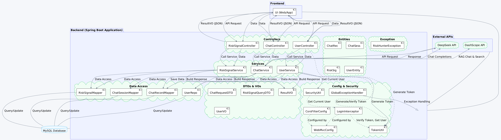
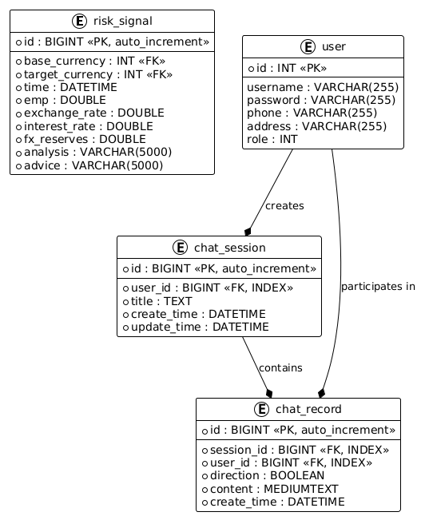
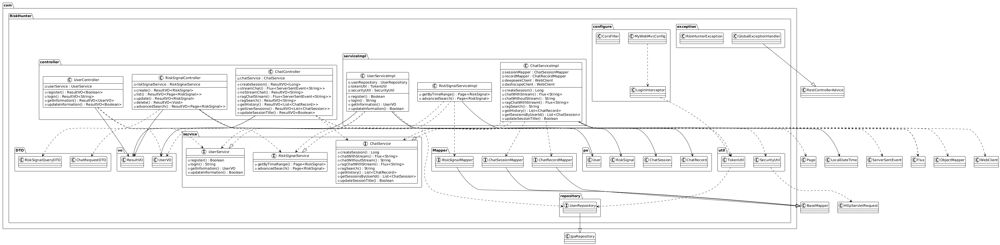
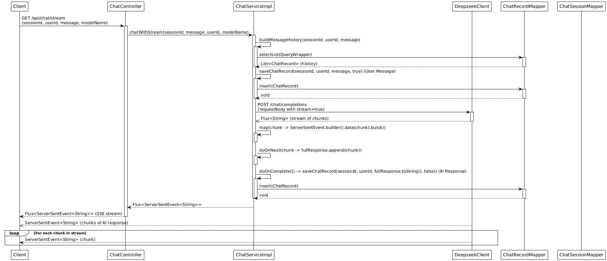
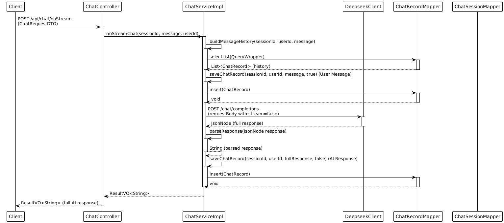
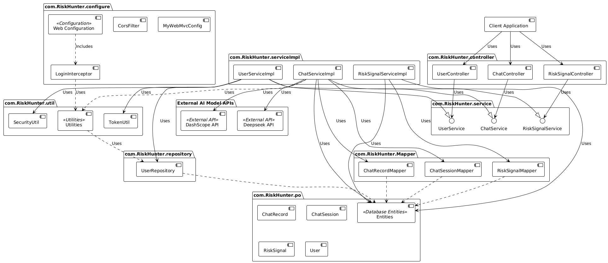

# RiskHunter 详细设计文档

## 1. 概述

RiskHunter 后端是一个 Spring Boot 应用程序，旨在提供风险分析和聊天功能。它专注于分析金融风险信号，并为用户提供人工智能驱动的聊天互动。该应用程序利用 MySQL 数据库进行数据持久化，MyBatis-Plus 进行 ORM，以及 Spring WebFlux 进行反应式流处理，尤其是在实时聊天功能方面。安全性通过 JWT（JSON Web Tokens）进行身份验证和授权来实现。

## 2. 数据库设计

数据库模式包含三个主要表：`risk_signal`，`user`，`chat_record` 和 `chat_session`。

### 2.1. 表结构

*   **`risk_signal`**: 存储历史风险信号数据。

    | 列名              | 数据类型      | 约束       | 描述                   |
    | ----------------- | ------------- | ---------- | ---------------------- |
    | `id`              | BIGINT        | 主键, 自增 | 主键                   |
    | `base_currency`   | INT           | 非空       | 基础货币 ID            |
    | `target_currency` | INT           | 非空       | 目标货币 ID            |
    | `time`            | DATETIME      | 非空       | 风险信号的时间戳       |
    | `emp`             | DOUBLE        | 非空       | 就业率百分比           |
    | `exchange_rate`   | DOUBLE        | 非空       | 汇率                   |
    | `interest_rate`   | DOUBLE        | 非空       | 利率百分比             |
    | `fx_reserves`     | DOUBLE        | 非空       | 外汇储备               |
    | `analysis`        | VARCHAR(5000) | 非空       | 风险信号分析           |
    | `advice`          | VARCHAR(5000) | 非空       | 基于风险信号分析的建议 |

*   **`user`**: 存储用户信息。

    | 列名       | 数据类型     | 约束   | 描述                                   |
    | ---------- | ------------ | ------ | -------------------------------------- |
    | `id`       | INT          | 主键   | 主键                                   |
    | `address`  | VARCHAR(255) | 可为空 | 用户地址                               |
    | `username` | VARCHAR(255) | 可为空 | 用户名                                 |
    | `password` | VARCHAR(255) | 可为空 | 用户密码（在实际应用中会进行哈希处理） |
    | `phone`    | VARCHAR(255) | 可为空 | 电话号码（在实际应用中应唯一）         |
    | `role`     | INT          | 可为空 | 用户角色                               |

*   **`chat_record`**: 存储会话中的单个聊天消息。

    | 列名          | 数据类型   | 约束       | 描述                            |
    | ------------- | ---------- | ---------- | ------------------------------- |
    | `id`          | BIGINT     | 主键, 自增 | 主键                            |
    | `session_id`  | BIGINT     | 非空, 索引 | 指向 `chat_session.id` 的外键   |
    | `user_id`     | BIGINT     | 非空, 索引 | 用户 ID                         |
    | `direction`   | BOOLEAN    | 非空       | 消息方向（true=用户，false=AI） |
    | `content`     | MEDIUMTEXT | 非空       | 消息内容                        |
    | `create_time` | DATETIME   | 非空       | 消息创建的时间戳                |

*   **`chat_session`**: 存储聊天会话的元数据。

    | 列名          | 数据类型 | 约束       | 描述                 |
    | ------------- | -------- | ---------- | -------------------- |
    | `id`          | BIGINT   | 主键, 自增 | 主键                 |
    | `user_id`     | BIGINT   | 非空, 索引 | 用户 ID              |
    | `title`       | TEXT     | 非空       | 会话标题             |
    | `create_time` | DATETIME | 非空       | 会话创建的时间戳     |
    | `update_time` | DATETIME | 非空       | 上次会话更新的时间戳 |

### 2.2. 数据库类图 (PlantUML)

## 3. API 设计

后端公开 RESTful API 以管理风险信号、用户帐户和聊天功能。

### 3.1. 风险信号 API (`/api/risk-signals`)

*   **`POST /api/risk-signals`**: 创建新的 RiskSignal。
    *   请求体：JSON 格式的 `RiskSignal` 对象。
    *   响应：包含已创建 RiskSignal 的 `ResultVO<RiskSignal>`。
*   **`GET /api/risk-signals`**: 列出 RiskSignal，带有可选的过滤器和分页。
    *   查询参数：
        *   `startTime` (可选, DateTime): 按开始时间过滤。
        *   `endTime` (可选, DateTime): 按结束时间过滤。
        *   `page` (可选, Integer, 默认=1): 分页的页码。
        *   `size` (可选, Integer, 默认=10): 分页的每页大小。
    *   响应：包含分页 RiskSignal 列表的 `ResultVO<Page<RiskSignal>>`。
*   **`PUT /api/risk-signals/{id}`**: 更新现有的 RiskSignal。
    *   路径参数：`id` (Long): 要更新的 RiskSignal 的 ID。
    *   请求体：包含更新信息的 JSON 格式的 `RiskSignal` 对象。
    *   响应：包含已更新 RiskSignal 的 `ResultVO<RiskSignal>`。
*   **`DELETE /api/risk-signals/{id}`**: 删除 RiskSignal。
    *   路径参数：`id` (Long): 要删除的 RiskSignal 的 ID。
    *   响应：指示成功的 `ResultVO<Void>`。
*   **`POST /api/risk-signals/search`**: 基于条件的高级搜索 RiskSignal。
    *   请求体：JSON 格式的 `RiskSignalQueryDTO` 对象。
    *   响应：包含匹配 RiskSignal 分页列表的 `ResultVO<Page<RiskSignal>>`。

### 3.2. 用户 API (`/api/users`)

*   **`POST /api/users/register`**: 注册新用户。
    *   请求体：JSON 格式的 `UserVO` 对象。
    *   响应：指示注册成功的 `ResultVO<Boolean>`。
*   **`POST /api/users/login`**: 登录用户并获取 JWT 令牌。
    *   查询参数：
        *   `phone` (String): 用户的电话号码。
        *   `password` (String): 用户的密码。
    *   响应：包含 JWT 令牌的 `ResultVO<String>`。
*   **`GET /api/users`**: 获取当前用户信息。需要身份验证（JWT 令牌）。
    *   Headers: `token`: JWT 令牌。
    *   响应：包含用户信息的 `ResultVO<UserVO>`。
*   **`POST /api/users`**: 更新当前用户信息。需要身份验证（JWT 令牌）。
    *   Headers: `token`: JWT 令牌。
    *   请求体：包含更新用户信息的 JSON 格式的 `UserVO` 对象。
    *   响应：指示更新成功的 `ResultVO<Boolean>`。

### 3.3. 聊天 API (`/api/chat`)

*   **`POST /api/chat/session`**: 创建新的聊天会话。
    *   查询参数：`userId` (Long): 用户 ID。
    *   响应：包含新会话 ID 的 `ResultVO<Long>`。
*   **`GET /api/chat/stream`**: 从 AI 模型流式传输聊天响应。
    *   查询参数：
        *   `sessionId` (Long): 聊天会话 ID。
        *   `userId` (Long): 用户 ID。
        *   `message` (String): 用户消息。
        *   `modelName` (可选, String): AI 模型名称（例如，`deepseek-r1`）。
    *   响应：通过服务器发送事件 `Flux<ServerSentEvent<String>>` 的聊天块流。
*   **`POST /api/chat/noStream`**: 从 AI 模型获取非流式聊天响应。
    *   请求体：JSON 格式的 `ChatRequestDTO` 对象。
    *   响应：包含完整聊天响应的 `ResultVO<String>`。
*   **`GET /api/chat/ragChat`**: 从 AI 模型流式传输 RAG（检索增强生成）聊天响应。
    *   查询参数：
        *   `sessionId` (Long): 聊天会话 ID。
        *   `userId` (Long): 用户 ID。
        *   `message` (String): 用户消息。
    *   响应：通过服务器发送事件 `Flux<ServerSentEvent<String>>` 的 RAG 聊天块流。
*   **`POST /api/chat/ragSearch`**: 执行 RAG 知识库搜索。
    *   请求体：JSON 格式的 `ChatRequestDTO` 对象。
    *   响应：包含搜索结果的 `ResultVO<String>`。
*   **`GET /api/chat/history/{sessionId}`**: 获取会话的聊天记录。
    *   路径参数：`sessionId` (Long): 聊天会话 ID。
    *   查询参数：`userId` (Long): 用户 ID。
    *   响应：包含聊天记录列表的 `ResultVO<List<ChatRecord>>`。
*   **`GET /api/chat/sessions`**: 获取用户的所有聊天会话。
    *   查询参数：`userId` (Long): 用户 ID。
    *   响应：包含聊天会话列表的 `ResultVO<List<ChatSession>>`。
*   **`PUT /api/chat/session/{sessionId}/title`**: 更新聊天会话标题。
    *   路径参数：`sessionId` (Long): 聊天会话 ID。
    *   查询参数：
        *   `userId` (Long): 用户 ID。
        *   `title` (String): 新的会话标题。
    *   响应：指示更新成功的 `ResultVO<Boolean>`。

## 4. 类图

此类图突出显示了后端应用程序中的主要组件及其关系。

## 5. 序列图

### 5.1. 流式聊天序列图

### 5.2. 非流式聊天序列图

## 6. 组件图

## 7. 技术栈

*   **编程语言：** Java 8
*   **框架：** Spring Boot 2.3.4.RELEASE
*   **数据库：** MySQL
*   **ORM：** MyBatis-Plus 3.5.3.1, Spring Data JPA
*   **Web：** Spring Web MVC, Spring WebFlux
*   **反应式流：** Reactor Netty
*   **JSON 处理：** Jackson
*   **JWT：** java-jwt 3.10.3
*   **数据库连接：** mysql-connector-j 8.0.31
*   **构建工具：** Maven
*   **日志记录：** Lombok, Slf4j
*   **测试：** Spring Boot Starter Test

## 8. 部署

RiskHunter 后端被设计为可以作为独立的 Spring Boot 应用程序进行部署。w我们使用Docker进行开发、测试和部署，确保环境的一致性。在应用程序服务器前端使用 Nginx反向代理，以处理静态内容、SSL 终端和负载平衡。

## 9. 安全

RiskHunter 安全性主要通过 JWT（JSON Web Tokens）进行身份验证和授权来处理：

*   **身份验证：** 用户登录根据数据库进行验证。 成功登录后，将生成 JWT 令牌并返回给客户端。
*   **授权：** 受保护的 API 端点使用 `LoginInterceptor` 进行保护。 此拦截器检查传入请求的 `Authorization` 标头中是否存在有效的 JWT 令牌。 如果令牌有效，则请求继续； 否则，该请求将被拒绝。
*   **令牌生成和验证：** `TokenUtil` 类负责在用户登录时生成 JWT 令牌，并验证后续请求的令牌。 令牌包含用户 ID 并且具有过期时间。
*   **CORS：** 配置 `CorsFilter` 以处理跨域资源共享，允许来自前端应用程序（例如，`http://localhost:3000`）的请求。
