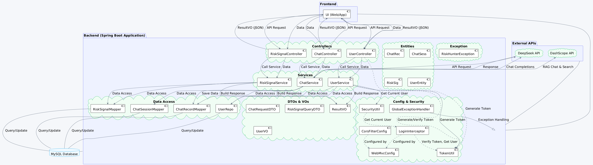
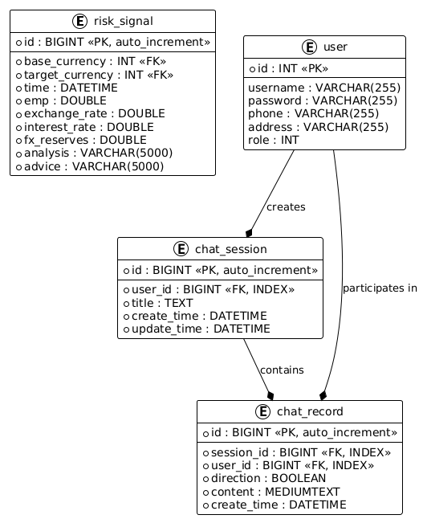
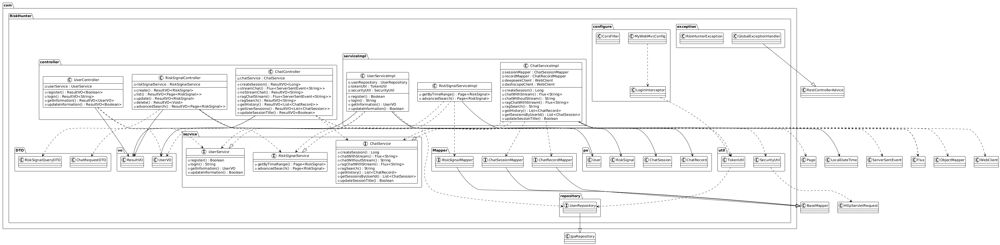
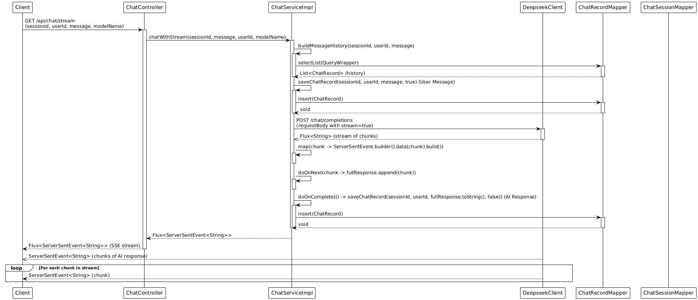
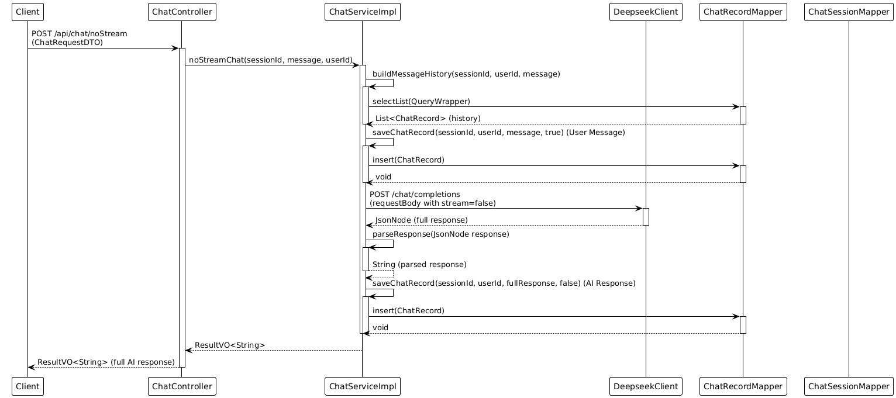
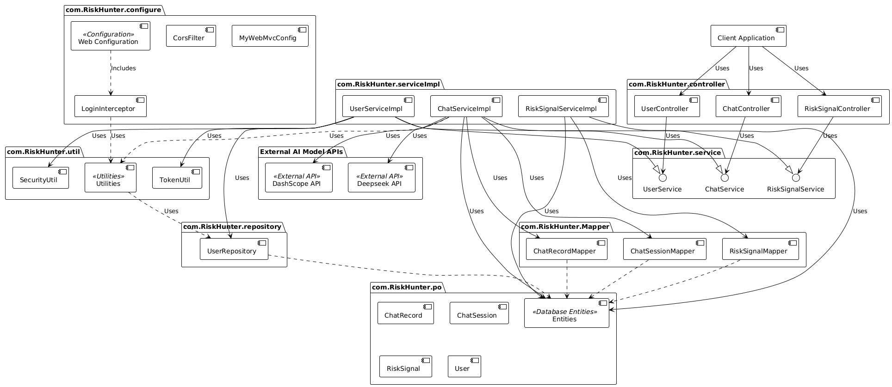

# RiskHunter Detailed Design Document
**Version**: v1.0.5
**Author**: NJU-SagaCiti
**Last Updated**: 2025.3.21

[TOC]

## 1. Overview

The RiskHunter backend is a Spring Boot application designed to provide risk analysis and chat functionalities. It focuses on analyzing financial risk signals and providing users with AI-powered chat interactions. The application utilizes a MySQL database for data persistence, MyBatis-Plus for ORM, and Spring WebFlux for reactive stream processing, especially in the real-time chat feature. Security is achieved through JWT (JSON Web Tokens) for authentication and authorization.

## 2. Database Design

The database schema includes three main tables: `risk_signal`, `user`, `chat_record`, and `chat_session`.

### 2.1. Table Structure

*   **`risk_signal`**: Stores historical risk signal data.

    | Column Name       | Data Type     | Constraints                 | Description                          |
    | ----------------- | ------------- | --------------------------- | ------------------------------------ |
    | `id`              | BIGINT        | Primary Key, Auto-increment | Primary Key                          |
    | `base_currency`   | INT           | Not Null                    | Base Currency ID                     |
    | `target_currency` | INT           | Not Null                    | Target Currency ID                   |
    | `time`            | DATETIME      | Not Null                    | Timestamp of the risk signal         |
    | `emp`             | DOUBLE        | Not Null                    | Employment Rate Percentage           |
    | `exchange_rate`   | DOUBLE        | Not Null                    | Exchange Rate                        |
    | `interest_rate`   | DOUBLE        | Not Null                    | Interest Rate Percentage             |
    | `fx_reserves`     | DOUBLE        | Not Null                    | Foreign Exchange Reserves            |
    | `analysis`        | VARCHAR(5000) | Not Null                    | Analysis of the risk signal          |
    | `advice`          | VARCHAR(5000) | Not Null                    | Advice based on risk signal analysis |

*   **`user`**: Stores user information.

    | Column Name | Data Type    | Constraints | Description                                  |
    | ----------- | ------------ | ----------- | -------------------------------------------- |
    | `id`        | INT          | Primary Key | Primary Key                                  |
    | `address`   | VARCHAR(255) | Nullable    | User Address                                 |
    | `username`  | VARCHAR(255) | Nullable    | Username                                     |
    | `password`  | VARCHAR(255) | Nullable    | User Password (hashed in actual application) |
    | `phone`     | VARCHAR(255) | Nullable    | Phone Number (should be unique in practice)  |
    | `role`      | INT          | Nullable    | User Role                                    |

*   **`chat_record`**: Stores individual chat messages within a session.

    | Column Name   | Data Type  | Constraints                 | Description                               |
    | ------------- | ---------- | --------------------------- | ----------------------------------------- |
    | `id`          | BIGINT     | Primary Key, Auto-increment | Primary Key                               |
    | `session_id`  | BIGINT     | Not Null, Index             | Foreign Key pointing to `chat_session.id` |
    | `user_id`     | BIGINT     | Not Null, Index             | User ID                                   |
    | `direction`   | BOOLEAN    | Not Null                    | Message Direction (true=User, false=AI)   |
    | `content`     | MEDIUMTEXT | Not Null                    | Message Content                           |
    | `create_time` | DATETIME   | Not Null                    | Timestamp of message creation             |

*   **`chat_session`**: Stores metadata about chat sessions.

    | Column Name   | Data Type | Constraints                 | Description                      |
    | ------------- | --------- | --------------------------- | -------------------------------- |
    | `id`          | BIGINT    | Primary Key, Auto-increment | Primary Key                      |
    | `user_id`     | BIGINT    | Not Null, Index             | User ID                          |
    | `title`       | TEXT      | Not Null                    | Session Title                    |
    | `create_time` | DATETIME  | Not Null                    | Timestamp of session creation    |
    | `update_time` | DATETIME  | Not Null                    | Timestamp of last session update |

### 2.2. Database Class Diagram (PlantUML)

## 3. API Design

The backend exposes RESTful APIs to manage risk signals, user accounts, and chat functionality.

### 3.1. Risk Signal API (`/api/risk-signals`)

*   **`POST /api/risk-signals`**: Create a new RiskSignal.
    *   Request Body: `RiskSignal` object in JSON format.
    *   Response: `ResultVO<RiskSignal>` containing the created RiskSignal.
*   **`GET /api/risk-signals`**: List RiskSignals with optional filters and pagination.
    *   Query Parameters:
        *   `startTime` (Optional, DateTime): Filter by start time.
        *   `endTime` (Optional, DateTime): Filter by end time.
        *   `page` (Optional, Integer, Default=1): Page number for pagination.
        *   `size` (Optional, Integer, Default=10): Page size for pagination.
    *   Response: `ResultVO<Page<RiskSignal>>` containing a paginated list of RiskSignals.
*   **`PUT /api/risk-signals/{id}`**: Update an existing RiskSignal.
    *   Path Parameter: `id` (Long): ID of the RiskSignal to update.
    *   Request Body: `RiskSignal` object in JSON format containing update information.
    *   Response: `ResultVO<RiskSignal>` containing the updated RiskSignal.
*   **`DELETE /api/risk-signals/{id}`**: Delete a RiskSignal.
    *   Path Parameter: `id` (Long): ID of the RiskSignal to delete.
    *   Response: `ResultVO<Void>` indicating success.
*   **`POST /api/risk-signals/search`**: Advanced search for RiskSignals based on conditions.
    *   Request Body: `RiskSignalQueryDTO` object in JSON format.
    *   Response: `ResultVO<Page<RiskSignal>>` containing a paginated list of matching RiskSignals.

### 3.2. User API (`/api/users`)

*   **`POST /api/users/register`**: Register a new user.
    *   Request Body: `UserVO` object in JSON format.
    *   Response: `ResultVO<Boolean>` indicating successful registration.
*   **`POST /api/users/login`**: Log in a user and obtain a JWT token.
    *   Query Parameters:
        *   `phone` (String): User's phone number.
        *   `password` (String): User's password.
    *   Response: `ResultVO<String>` containing the JWT token.
*   **`GET /api/users`**: Get current user information. Requires authentication (JWT token).
    *   Headers: `token`: JWT token.
    *   Response: `ResultVO<UserVO>` containing user information.
*   **`POST /api/users`**: Update current user information. Requires authentication (JWT token).
    *   Headers: `token`: JWT token.
    *   Request Body: `UserVO` object in JSON format containing updated user information.
    *   Response: `ResultVO<Boolean>` indicating successful update.

### 3.3. Chat API (`/api/chat`)

*   **`POST /api/chat/session`**: Create a new chat session.
    *   Query Parameters: `userId` (Long): User ID.
    *   Response: `ResultVO<Long>` containing the new session ID.
*   **`GET /api/chat/stream`**: Stream chat responses from an AI model.
    *   Query Parameters:
        *   `sessionId` (Long): Chat session ID.
        *   `userId` (Long): User ID.
        *   `message` (String): User message.
        *   `modelName` (Optional, String): AI model name (e.g., `deepseek-r1`).
    *   Response: Stream of chat chunks as Server-Sent Events `Flux<ServerSentEvent<String>>`.
*   **`POST /api/chat/noStream`**: Get a non-streaming chat response from an AI model.
    *   Request Body: `ChatRequestDTO` object in JSON format.
    *   Response: `ResultVO<String>` containing the complete chat response.
*   **`GET /api/chat/ragChat`**: Stream RAG (Retrieval-Augmented Generation) chat responses from an AI model.
    *   Query Parameters:
        *   `sessionId` (Long): Chat session ID.
        *   `userId` (Long): User ID.
        *   `message` (String): User message.
    *   Response: Stream of RAG chat chunks as Server-Sent Events `Flux<ServerSentEvent<String>>`.
*   **`POST /api/chat/ragSearch`**: Perform a RAG knowledge base search.
    *   Request Body: `ChatRequestDTO` object in JSON format.
    *   Response: `ResultVO<String>` containing the search results.
*   **`GET /api/chat/history/{sessionId}`**: Get the chat history for a session.
    *   Path Parameter: `sessionId` (Long): Chat session ID.
    *   Query Parameters: `userId` (Long): User ID.
    *   Response: `ResultVO<List<ChatRecord>>` containing a list of chat records.
*   **`GET /api/chat/sessions`**: Get all chat sessions for a user.
    *   Query Parameters: `userId` (Long): User ID.
    *   Response: `ResultVO<List<ChatSession>>` containing a list of chat sessions.
*   **`PUT /api/chat/session/{sessionId}/title`**: Update the title of a chat session.
    *   Path Parameter: `sessionId` (Long): Chat session ID.
    *   Query Parameters:
        *   `userId` (Long): User ID.
        *   `title` (String): New session title.
    *   Response: `ResultVO<Boolean>` indicating successful update.

## 4. Class Diagram

This class diagram highlights the key components in the backend application and their relationships.

## 5. Sequence Diagrams

### 5.1. Streaming Chat Sequence Diagram

### 5.2. Non-Streaming Chat Sequence Diagram

## 6. Component Diagram

## 7. Technology Stack

*   **Programming Language:** Java 8
*   **Framework:** Spring Boot 2.3.4.RELEASE
*   **Database:** MySQL
*   **ORM:** MyBatis-Plus 3.5.3.1, Spring Data JPA
*   **Web:** Spring Web MVC, Spring WebFlux
*   **Reactive Stream:** Reactor Netty
*   **JSON Processing:** Jackson
*   **JWT:** java-jwt 3.10.3
*   **Database Connection:** mysql-connector-j 8.0.31
*   **Build Tool:** Maven
*   **Logging:** Lombok, Slf4j
*   **Testing:** Spring Boot Starter Test

## 8. Deployment

The RiskHunter backend is designed to be deployed as a standalone Spring Boot application. We utilize Docker for development, testing, and deployment, ensuring environment consistency. Nginx is used as a reverse proxy in front of the application servers to handle static content, SSL termination, and load balancing.

## 9. Security

RiskHunter security is primarily handled through JWT (JSON Web Tokens) for authentication and authorization:

*   **Authentication:** User login is validated against the database. Upon successful login, a JWT token is generated and returned to the client.
*   **Authorization:** Protected API endpoints are secured using a `LoginInterceptor`. This interceptor checks for the presence of a valid JWT token in the `Authorization` header of incoming requests. If the token is valid, the request proceeds; otherwise, the request is rejected.
*   **Token Generation and Validation:** The `TokenUtil` class is responsible for generating JWT tokens upon user login and validating tokens for subsequent requests. Tokens contain the user ID and have an expiration time.
*   **CORS:** `CorsFilter` is configured to handle Cross-Origin Resource Sharing, allowing requests from the frontend application (e.g., `http://localhost:3000`).
